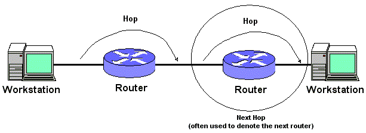

# Aplicação Visual BFS/DFS: Grafos

Como requisito da disciplina de Resolução de Problemas com Grafos, esta aplicação foi desenvolvida em JavaFX para visualização, análise e simulação de percursos em grafos, com animação de buscas em largura e profundidade e análise de propriedades estruturais.

## Sumário

- [Visão Geral](#visão-geral)
- [Modelagem](#modelagem)
- [Funcionalidades](#funcionalidades)
- [Tecnologias](#tecnologias)
- [Como Executar](#como-executar)
- [Formato de Entrada](#formato-de-entrada)
- [Estrutura do Projeto](#estrutura-do-projeto)
- [Desenvolvimento](#desenvolvimento)
- [Possíveis Evoluções](#possíveis-evoluções)
- [Referências](#referências)

## Visão Geral

A aplicação permite:

- carregar um grafo a partir de arquivo ou entrada manual (CLI);
- visualizar o grafo em interface gráfica;
- executar BFS e DFS com animação;
- exibir caminho encontrado entre origem e destino;
- calcular estatísticas como ordem, tamanho, densidade, graus e hubs.

## Modelagem

A modelagem foi feita com a utilização de grafos não direcionados para representar a bidirecionalidade das conexões em redes locais, refletindo os caminhos para o fluxo de dados. Além disso, optou-se por arestas não ponderadas, já que o foco da modelagem está na conectividade física e na existência, ou não, de caminhos entre vértices, e não em custos variáveis de transmissão.

Então, essa modelagem funciona para representar e fazer busca de caminhos com o menor número de hops (saltos), onde cada aresta percorrida equivale a um salto entre dispositivos adjacentes. A partir do BFS, o sistema mapeia a topologia em camadas de profundidade, garantindo que a rota encontrada seja sempre a de menor latência física teórica, isto é, o mínimo de saltos.



Essa métrica permite calcular a altura do grafo a partir de uma raiz, definida como o maior número de hops necessários para alcançar o nó mais periférico, e também identificar a vizinhança de raio `k`, delimitando o alcance direto de um nó na rede representada.

Em adição, a análise identifica os hubs, definidos como vértices com maior grau de conectividade, que concentram maior potencial de distribuição de hops e são relevantes no contexto proposto.

Caso fosse necessário acrescentar uma camada de latência, o modelo deveria evoluir para arestas ponderadas, permitindo representar com mais fidelidade o comportamento real de redes e comparar caminhos não apenas pela mera existência, mas também pelo custo de comunicação. Nesse cenário, o algoritmo de Dijkstra é uma alternativa, uma vez que BFS e DFS não garantem resultados ótimos de menor latência.

## Funcionalidades

- Visualização gráfica da topologia.
- Execução animada de BFS.
- Execução animada de DFS.
- Destaque visual do caminho encontrado.
- Exibição da distância entre origem e destino quando aplicável.
- Cálculo de:
  - tipo do grafo;
  - ordem (`|V|`);
  - tamanho (`|E|`);
  - densidade;
  - graus dos vértices;
  - top-3 hubs;
  - maior nível alcançado na BFS;
  - vizinhança até profundidade `k`.

## Tecnologias

- Java 25
- JavaFX 21
- Maven Wrapper
- SmartGraph 2.2.0

## Como Executar

### Pré-requisitos

- JDK 25 instalada

### Execução da aplicação

No diretório raiz do projeto:

```powershell
.\mvnw.cmd javafx:run
```

Ao iniciar, a aplicação solicitará no terminal uma das opções:

```text
1) Carregar topologia de 'data.txt'
2) Digitar topologia manualmente
```

Depois da escolha, a interface gráfica será aberta para visualização e execução das buscas.

### Executar testes e compilação

```powershell
.\mvnw.cmd test
```

## Formato de Entrada

O arquivo `data.txt` e a entrada manual seguem o formato:

```text
nVertices nArestas tipo
u1 v1
u2 v2
...
```

Exemplo:

```text
5 4 U
0 1
1 2
1 3
3 4
```

Onde:

- `U` indica grafo não direcionado;
- `D` indica grafo direcionado;
- cada linha seguinte representa uma aresta entre dois vértices.

## Estrutura do Projeto

```text
src/main/java/com/said/av1grafos
|-- controller
|   `-- GraphController.java
|-- io
|   |-- GraphInput.java
|   `-- TerminalInputHandler.java
|-- model
|   |-- BfsMetrics.java
|   |-- GraphData.java
|   |-- GraphStatistics.java
|   |-- TraversalAlgorithm.java
|   |-- TraversalResult.java
|   `-- TraversalStep.java
|-- service
|   |-- GraphRenderer.java
|   |-- GraphStatisticsService.java
|   |-- TraversalAnimator.java
|   `-- TraversalService.java
`-- Main.java
```

### Organização por responsabilidade

- `controller`: coordena eventos da interface e interação com os serviços.
- `io`: leitura de dados por arquivo e terminal.
- `model`: estruturas de dados e objetos de resultado.
- `service`: regras de negócio, renderização, animação e estatísticas.

## Desenvolvimento

Para trabalhar no projeto localmente:

```powershell
git clone <url-do-repositorio>
cd AV1-GRAFOS
.\mvnw.cmd test
.\mvnw.cmd javafx:run
```

## Possíveis Evoluções

- suporte a grafos ponderados;
- cálculo de caminhos mínimos com Dijkstra;
- detecção de pontes e vértices de articulação;
- exportação de resultados da análise;
- adição de testes automatizados para serviços de percurso e estatísticas.

## Referências

- Biblioteca de visualização: [SmartGraph](https://github.com/brunomnsilva/JavaFXSmartGraph)
